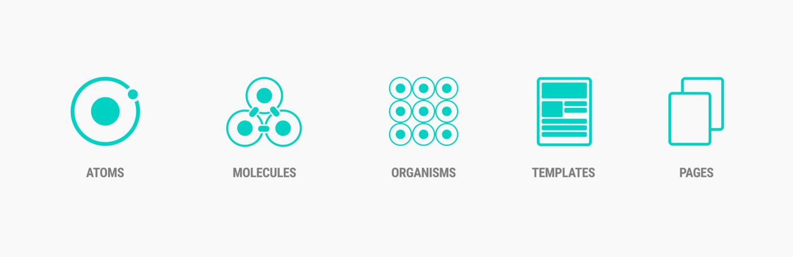

# Components

We leverage Atomic Design principles to organize our components, enabling us to create a modular and scalable design library.

## Atoms
- HAvatar: Avatar component to represent users or entities.
- [HButton](/components/atoms/button.md): Button component for user interaction.
- [HCard](/components/atoms/card.md): Card component for displaying content in a structured manner.
- HDivider: Divider component to visually separate content.
- [HGridContainer](/components/atoms/grid.md): Grid container component for organizing layout.
- [HGridItem](/components/atoms/grid.md): Grid item component for grid layout.
- [HIcon](/components/atoms/icon.md): Icon component for displaying graphical symbols.
- HImage: Image component for displaying images.
- [HInput](/components/atoms/input.md): Input component for user input.
- HSelect: Select component for selecting options from a list.
- HSlider: Slider component for selecting a value from a range.
- HTooltip: Tooltip component for displaying additional information on hover.
- HBadge: Badge component for indicating status or count.
- [HText](/components/atoms/text.md): Text component for displaying textual content.
- HSuspense: Suspense component for handling asynchronous loading states.
- HLoading: Loading component for indicating ongoing processes.
- HCheckbox: Checkbox component for selecting multiple options.
- HRadio: Radio component for selecting single option from a list.
- HMenu: Menu component for navigation or dropdown menus.
- HMenuItem: Menu item component for menu options.

## Molecules

- HTextField: Text field component for user input with label and input field.
- HDropdown: Dropdown component for selecting options from a list.
- HInputField: Input field component with label and input field.
- HModal: Modal component for displaying content in a modal dialog.
- HToast: Toast component for displaying notifications.
- HStepper: Stepper component for guiding users through a process.
- HForm: Form component for collecting user input.
- HSteps: Steps component for displaying a sequence of steps.
- HStep: Step component for individual steps within a process.
- HTabs: Tabs component for organizing content into tabs.
- HTab: Tab component for individual tabs.
- HBreadcrumb: Breadcrumb component for indicating the current page's location within a hierarchy.